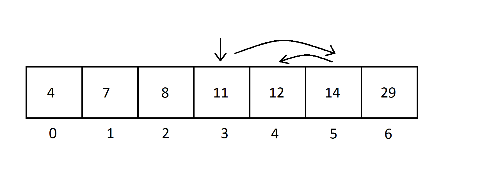

# Algorithms

An _algorithm_ is a finite sequence of well-defined instructions performed to accomplish a certain task. An algorithm can be used to define the steps of sorting an array, performing complex calculations, or even making your favorite recipe.

Often when we define a method in Java to perform a particular task for us, we are defining an algorithm.

## Optimizing Algorithms 

Many times when we try to solve a problem, we start with the simplest or most straightforward solution - a _brute force implementation_. Brute force implementations are generally not very elegant or efficient, but they get the task done. It's a good idea to start off with a brute force implementation, but many times we can refactor our solution to be more efficient.

Let's take a look at an example. Let's assume we have a sorted int array and we want to search for a particular integer in the array. We could define a brute force implementation where we check each element in the array for int 'x' in question.


```java
    public int search(int arr[], int x){
        for (int i = 0; i < arr.length; i++){
            if (arr[i] == x){
                return i;
            }
        }
        return -1;
    }
```

However, we can tackle this problem more efficiently. Because the array is sorted, we don't have to check each element. We can perform a binary search instead.



```java 
    public int search(int arr[], int x) {
        int l = 0, r = arr.length - 1;

        while (l <= r) {
            int m = l + (r - l) / 2;

            if (arr[m] == x)
                return m;

            if (arr[m] < x)
                l = m + 1;
            else
                r = m - 1;
        }
        return -1;
    }
```

## Measuring Algorithm Efficiency

Computers are able to do individual tasks quickly so when we measure algorithms, rather than focus on how many steps the algorithm has, we focus on how the number of steps change as the input scales. Think about our example above - the total number of steps that our algorithm has to take to search for a value depends on the size of the array.  As the array size increases, so does the number of operations we need to perform. For a linear search, we must perform one additional iteration for each element we add to the array.  For a binary search, we must perform one additional iteration when we double the array.  Based on this analysis, we can conclude that the binary search algorithm is more efficient.

In order to better analyze and optimize algorithms, we need a way to measure an algorithm's efficiency as the input scales. That way we can compare different implementations and their relative efficiencies and choose the best solution. 

We can use _asymptotic notation_ to measure these two search algorithm. Asymptotic notation includes Omega notation, Theta notation and Big-O notation. Each of these notations are ways for us to describe the running time of an algorithm as it approaches large input values.

Big-O is the most popular of the asymptotic notations. It's used to evaluate your code for worst case running time as your input size approaches an infinitely large number. Let's apply this idea to the linear and binary search above.


Image source: https://droidtechknow.com/programming/algorithms/big-o-notation/images/big-o-notation.jpg

Asymptotic notation is helpful for measuring both _time complexity_ and also _space complexity_. In our analysis above of a linear vs binary search, we compared their time complexity - the relative time needed to perform a certain operation. It is often important to evaluate space complexity as well - the relative amount of memory needed to perform certain operations.

Let's take a look at a couple sorting algorithms to see an example of this. 

### Bubble Sort 

[Wikipedia GIF on Bubble Sort](https://upload.wikimedia.org/wikipedia/commons/c/c8/Bubble-sort-example-300px.gif)

### Merge Sort

[Wikipedia GIF on Bubble Sort](https://upload.wikimedia.org/wikipedia/commons/c/cc/Merge-sort-example-300px.gif)

This [Big O Cheat Sheet](https://www.bigocheatsheet.com/) compares complexities and shows time and space complexity for common algorithms.

## Exercises

Find the time and space complexity for the following algorithms. Use Big-O notation.

1. Finding the max value in an array.

```java
    public int findMax(int[] arr){
        int max = arr[0];
        for(int i: arr){
            if(i>max){
                max = i;
            }
        }   
        return max;
    }
```

2. Find the sum of two values.

```java
    public int findSum(int a, int b) {
        return a + b;
    }
```


3. Find the sum and product of an array.
   
```java
    void printSumAndProduct(int[] array) {
        int sum = 0;
        int product = 1;
        for (int i = 0; i < array.length; I++) {
            sum += array[i];
        }
        for (int i = 0; i < array.length; i++) {
            product *= array[i];
        } 
        System.out.println(sum + ", " + product);
    }
```

4. Print array values and constant set of numbers.
```java
    void printArrayValues(int[] arr) {
        for(int a : arr) {
            System.out.println(a);       
        }
        for (int i = 0; i < 1000000; i++) {
            System.out.println(i);       
        }
    }
```

5. Print array values and constant set of numbers for each number.
```java
    void printArrayValues(int[] arr) {
        for(int a : arr) {
            System.out.println(a); 
            for (int i = 0; i < 1000000; i++) {
                System.out.println(i);       
            }      
        }
        
    }
```

<!-- 
https://kodr.me/en/big-o-examples

# Types of Algorithms
DS&A: Recursive algorithms
DS&A: Greedy Algorithms

DS&A: Depth-First Searching
DS&A: Breadth-First Searching
DS&A: Branch & Bound Algorithms
DS&A: Dynamic Programming
DS&A: Divide & Conquer Algorithms -->