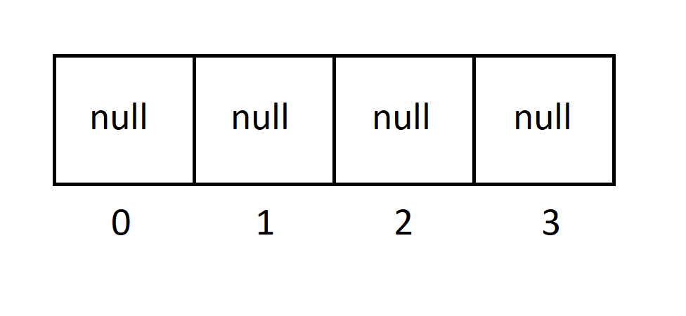
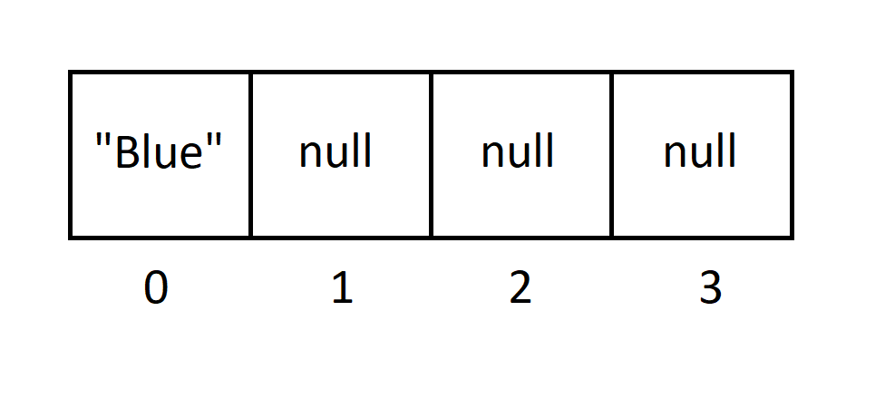
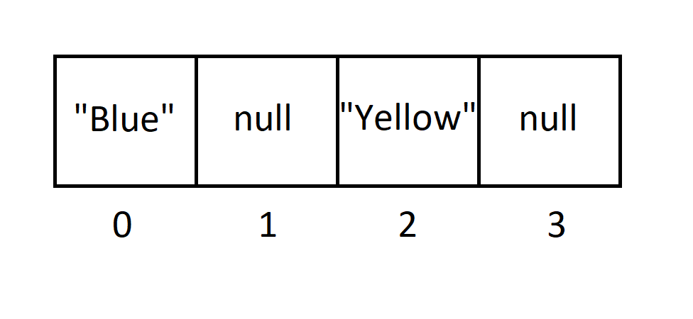

# Data Structures
Data structures provide a means for organizing and managing groups of data. There are many types of data structures. In Java, we are provided with the Collection API which contains many pre-implemented data structures for us to use. 

## Arrays
One of the most basic data structures available in Java is an array. An array is a fixed-length data structure that can hold any type of homogenous data. If a different size is needed, an array cannot be resized; a new array would need to be created of the desired size.

When initializing arrays, bracket notation is used along with the type the array contains. 

```java
    int[] arr1; // preferred
    int arr1[];
```

The size of the array is also needed when initialized.

```java
    int[] arr1 = new int[3]; 
    int[] arr2 = {23,57,2,-8}; 
```

### Array Indexing Strategies
Arrays have a 0-based index, meaning that the index starts at 1 and continue to length-1. Bracket notation is used to assign and access values in an array.

```java
    String[] arr = new String[4];
```



```java
    arr[0] = "Green";
```


```java
    arr[0] = "Blue";
```



```java
    arr[2] = "Yellow";
```



```java
    arr[5] = "Red";
    // this gives us an ArrayIndexOutOfBoundsException
```

Java also provides a helpful [utility class](https://docs.oracle.com/javase/8/docs/api/java/util/Arrays.html) for arrays, with static methods for operations such as sorting and searching.

### Multidimensional Arrays

Multidimensional Arrays are supported in Java, by creating arrays of arrays. Let's say, for example, we create an application to simulate the game play of tic tac toe. In order to do that, we need a representation of a 3x3 grid of characters. We can do this by creating three char arrays which we store in an array.

```java
    char[][] board = new char[3][3];
    /* 
        we can represent this visually as:
        [ [' ', ' ', ' '], [' ', ' ', ' '], [' ', ' ', ' '] ]

        or more intuitively as:
        [ 
            [' ', ' ', ' '], 
            [' ', ' ', ' '], 
            [' ', ' ', ' '] 
        ]
        
    */
```

We can assign and access elements of nested arrays, with bracket notation as well. In this case, the first index represents the top level array - which row we are referring to. The second index represents the nested array - which position in the row we are referring to.

```java
    board[0][0] = 'X';
    /* 
        [ 
            ['X', ' ', ' '], 
            [' ', ' ', ' '], 
            [' ', ' ', ' '] 
        ]     
    */
```

```java
    board[1][2] = 'O';
    /* 
        [ 
            ['X', ' ', ' '], 
            [' ', ' ', 'O'], 
            [' ', ' ', ' '] 
        ]     
    */
```

```java
    board[2][0] = 'X';
    /* 
        [ 
            ['X', ' ', ' '], 
            [' ', ' ', 'O'], 
            ['X', ' ', ' '] 
        ]     
    */
```

To iterate over a multidimensional, we would need to use a nested loop.

```java
    for(char[] row: board){
        for(char mark: row){
            System.out.print(mark+" ");
        }
        System.out.println();
    }
    
```

**Challenge:** write a method that determines if someone has won tic tac toe. It should take an input of a two dimensional char array and return the character of the winner, if the board is in a winning state.

For more on arrays, see Java's tutorial [here](https://docs.oracle.com/javase/tutorial/java/nutsandbolts/arrays.html).

<!-- ## Array List
DS&A: Array Lists

## Linked List
DS&A: Linked Lists

## Queues 
DS&A: Queues
DS&A: Dequeue

## Stacks
A stack is a data structure used for first in last out (FIFO) data processing. Browser history is a good application of a stack. When you navigate to a new web page, you expect that your browser keeps track of your navigation history. When you click on the back button, you want the browser to navigate to the last page


While there is a `Stack` class in Java, it inherits from the `Vector` class, which has become obsolete in favor of other Collections. Any implementation of `Dequeue`, such as `ArrayDequeue` or `LinkedList`, will provide you the needed functionality for FIFO data processing. 

## Maps
DS&A: Hash Functions
DS&A: Trees

## Sets 
DS&A: Sets

## Graphs 
DS&A: Graphs -->
